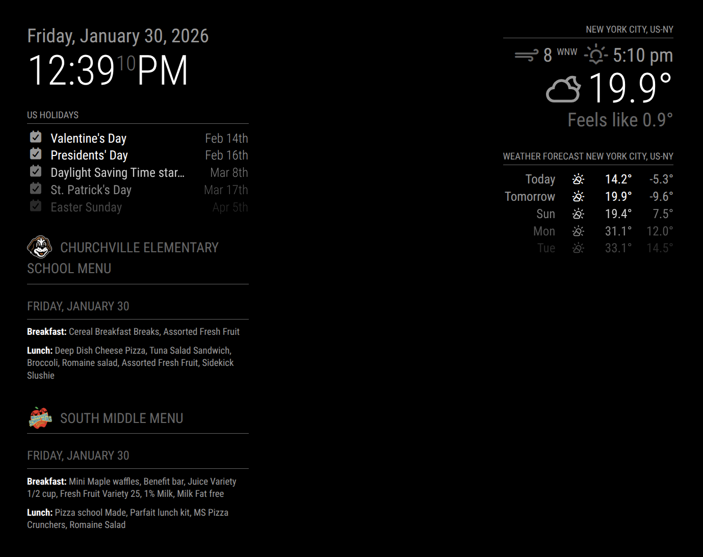
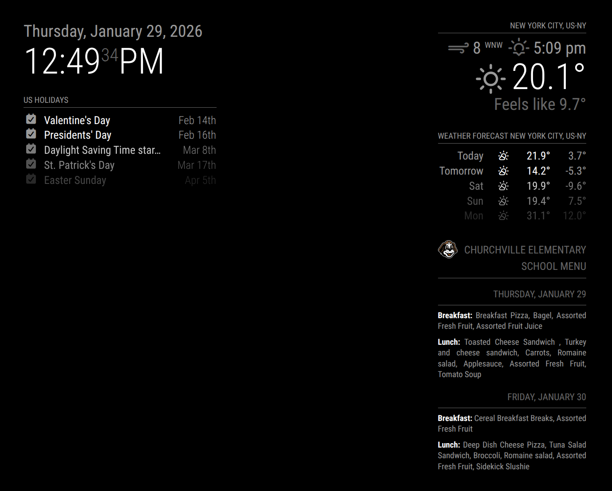
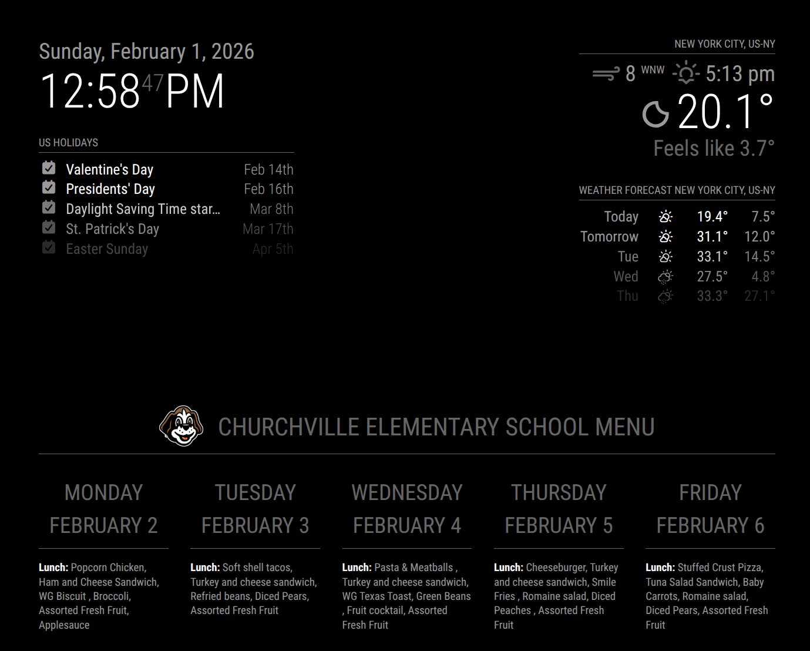

# MMM-MealViewer

A MagicMirror module for displaying school breakfast and lunch menus from MealViewer. You can check to see if your school uses MealViewer [here](https://schools.mealviewer.com/). 

**Note - if there are no valid menus for the current week (ie- school is out) the module will not display.*

- [Screenshots](#screenshots)
- [Installation](#installation)
- [Update](#update)
- [Configuration](#configuration)
    - [Required Configuration](#required-configuration)
    - [Optional Configuration](#optional-configuration)
    - [Filters](#filters)
    - [Configuration for Multiple School Menus](#configuration-for-multiple-school-menus)
- [Responsive Scaling](#responsive-scaling) *(new in v1.1.0)*


## Screenshots

### Single instance


### Multiple instances



## Installation

1\. Navigate to your MagicMirror's `modules` directory:

```bash
cd ~/MagicMirror/modules/
```

2\. Clone this repository:

```bash
git clone https://github.com/ElliAndDad/MMM-MealViewer.git
```

That's it! No additional dependencies required.

## Update

To update the module to the latest version:

1\. Navigate to the module folder:

```bash
cd ~/MagicMirror/modules/MMM-MealViewer
```

2\. Pull the latest changes:

```bash
git pull
```

3\. Restart MagicMirror.

## Configuration

Add the following to your `config.js` file:

```javascript
{
    module: "MMM-MealViewer",
    position: "top_left",
    config: {
        schoolId: "YourSchoolId",
        updateInterval: 14400000, // 4 hours, adjust as needed
        showTodayOnly: false, // set to true if you want to see only today
        startDay: 0, // 0 = Sunday, 1 = Monday, ..., 6 = Saturday (Ignored if showTodayOnly = true)
        endDay: 5, // 0 = Sunday, 1 = Monday, ..., 6 = Saturday (Ignored if showTodayOnly = true)
        maxDisplayDays: null, // Set a number of days to display, null = no limit (Ignored if showTodayOnly = true)
        showPastDays: false, // Set to true to show previous days menus
        hideTodayAfter: "14:00", // Specify the time after which to stop showing today's menu
        showBreakfast: true, // Set to false to not show breakfast menus
        showLunch: true, // Set to false to not show lunch menus
        collapseEmptyMeals: true, // hide days with no menu data
        lookAhead: false, // Set to true to show next week's menu when the current week ends
        filters: {
            breakfast: [],
            lunch: []
        },
        itemTypeFilters: {
            breakfast: [],
            lunch: []
        },
        exactNameFilters: {
            breakfast: [],
            lunch: []
        },
        startsWithFilters: {
            breakfast: [],
            lunch: []
        }
    }
}
```

## Required Configuration

`schoolId`

- To find your school ID go to <a href="https://schools.mealviewer.com/" target="_blank">MealViewer</a>, search for your school and click on it.

- The url will look like `https://schools.mealviewer.com/school/YourSchoolID`

- Copy `YourSchoolID` and paste it into the config.js

*Example*
```javascript
 module: "MMM-MealViewer",
 position: "top_right",
 config: {
     schoolId: "MLKElementary",
```

## Optional Configuration

1\. `updateInterval`

How often to fetch new data, in milliseconds. The default is 4 hours, adjust this as you like.

*Example*
```javascript
     updateInterval: 3600000, // 1 hour
```   

2\. `showTodayOnly`

To show only today's menu, set to `true`. When set to `true`, `startDay`, `endDay` and `maxDisplayDays` settings are ignored.

*Example*
```javascript
     showTodayOnly: true,
```  

3\. `startDay` and `endDay`

- Define the range of days to display in the menu.
- Values: 0 (Sunday) to 6 (Saturday)
- Default: startDay = 1 (Monday), endDay = 5 (Friday)

*Example*
```javascript
     startDay: 0, // Start from Sunday
     endDay: 6,   // End on Saturday
```

4\. `maxDisplayDays`

Set a maximum number of days to display.

*Example*
```javascript
     startDay: 1, // start on Monday
     endDay: 5,  // end on Friday
     maxDisplayDays: 3, // display only 3 days of data at a time. On Monday it would show Monday, Tuesday, Wednesday data
```

5\. `showPastDays`

- Whether to show menus for days that have already passed.
- Default: false

*Example*
```javascript
     showPastDays: true, // Show past days' menus
```

6\. `hideTodayAfter`

- Time after which to hide today's menu.
- Format: 24-hour time as a string, or "never" to always show today's menu.
- Default: "14:00"

*Example*
```javascript
     hideTodayAfter: "never", // Show today's menu until the end of the day
```

7\. `showBreakfast` and `showLunch`

- Whether to display breakfast and lunch menus.
- Default: true for both

*Example*
```javascript
     showBreakfast: false, // Don't show breakfast menu
     showLunch: true,      // Show lunch menu
```

8\. `lookAhead`

- When enabled, automatically shows next week's menu starting on `endDay` after `hideTodayAfter` time, and continues through any days before `startDay`. This is useful for weekend meal planning.
- When disabled, the module shows the current week's menu until the week ends.
- Default: false

*Example*
```javascript
     lookAhead: true, // Enable automatic look-ahead to next week
```

## Filters

This module offers four types of filters to remove menu items you don't want to display. Each filter type can be applied separately to breakfast and/or lunch menus. For help with filtering items or categories, uncomment lines 51 and 66 in `node_helper.js`, this will write `parsedMealData.json` and `rawMealData.json` files to your `MMM-MealViewer` folder when you run the module. You can then search the data in these files to find `item_Type`, `item_name`, etc that you want to remove.

1\. `filters`

- Partial Match Filters
- Excludes items if any part of the item name includes the specified string.
- Case-insensitive.

*Example:*
```javascript
     filters: {
         breakfast: ["Cereal"],
         lunch: []
     },
```
Would exclude "Cheerios Cereal", "Cereal Bar", "Rice Cereal", etc.

2\. `itemTypeFilters`

- Excludes items based on their type category.
- Exact match, case-sensitive.

*Example:*
```javascript
     itemTypeFilters: {
         breakfast: ["Milk"],
         lunch: ["Milk"]
     },
```

Would exclude all items categorized as "Milk".


3\. `exactNameFilters`

- Excludes items only if the entire item name matches the specified string exactly.
- Case-sensitive.

*Example:*
```javascript
     exactNameFilters: {
         breakfast: [],
         lunch: ["Ketchup Packet"]
     },
```

Would only exclude an item named exactly "Ketchup Packet", but not "Ketchup Packets" or "Packet of Ketchup".

4\. `startsWithFilters`

- Excludes items if the item name starts with the specified string.
- Case-insensitive.

*Example:*
```javascript
     startsWithFilters: {
         breakfast: [],
         lunch: ["Garden Bar"]
     }
```
Would exclude "Garden Bar Tomatoes", "Garden Bar Lettuce", etc.

## Configuration for Multiple School Menus

To display menus for multiple schools on your MagicMirror, you can add multiple instances of the MMM-MealViewer module to your config file.

Here's an example configuration for displaying menus from two different schools:

```javascript
{
    module: "MMM-MealViewer",
    position: "top_left",
    config: {
        schoolId: "YourSchoolId1",
        // ... other config options
    }
},
{
    module: "MMM-MealViewer",
    position: "top_right",
    config: {
        schoolId: "YourSchoolId2",
        // ... other config options
    }
}
```

Remember to add a unique `schoolId` to each instance by following the instructions [here](#required-configuration).

## Responsive Scaling

The module automatically scales to fit the width of your MagicMirror region using CSS Container Queries. Place it in a narrow column and it stays compact; place it in a wider region and everything scales up proportionally.

### Position-Aware Layouts

The module adapts its layout based on position:

| Position | Layout |
|----------|--------|
| `top_left`, `bottom_left` | Stacked days, left-aligned |
| `top_right`, `bottom_right` | Stacked days, right-aligned headers, justified text |
| `top_center`, `bottom_center` | Stacked days, centered |
| `top_bar`, `bottom_bar` | Multi-column (days side-by-side), centered |
| `upper_third`, `middle_center`, `lower_third` | Multi-column (days side-by-side), centered |
| `fullscreen_above`, `fullscreen_below` | Multi-column (days side-by-side), centered |

#### Right-aligned (top_right, bottom_right):



#### Multi-column layout (full-width positions):



### Browser Requirements

This module uses CSS Container Queries which require a modern browser. Make sure your MagicMirror is running on Electron 105+ or a current Chromium-based browser.

## Troubleshooting

### Module not appearing
- Check that the module name in `config.js` matches exactly: `"MMM-MealViewer"`
- Verify the position is valid (e.g., `"top_left"`)
- Check the browser console for JavaScript errors

### Menus not showing
- Verify your `schoolId` is correct
- Check that your school has menus available on MealViewer
- Events automatically hide 24 hours after they pass

### lookAhead not working as expected
- Look-ahead triggers after `hideTodayAfter` time on `endDay`, then continues until the next `startDay`
- Make sure `hideTodayAfter` is set appropriately for when you want to see next week's menu

## License

MIT License - see [LICENSE](LICENSE) file for details.